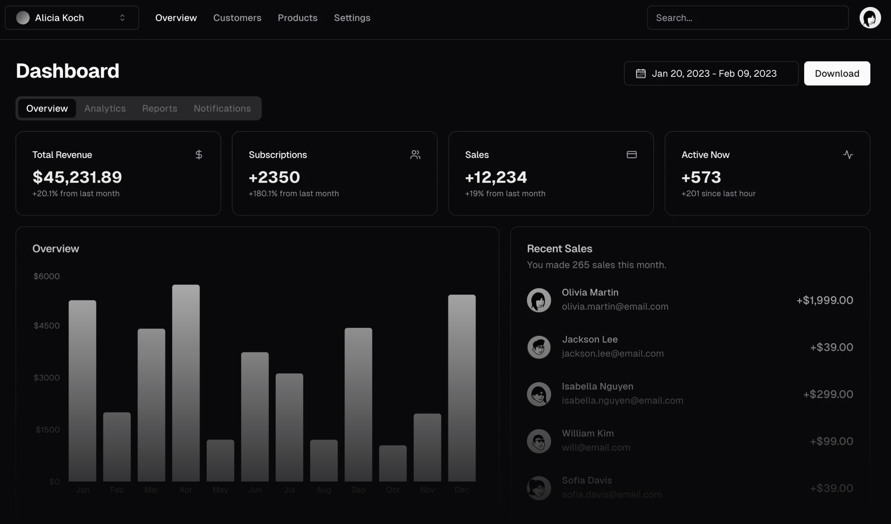

# Social Automation - Social Media Automation Platform



Social Automation is a powerful social media automation platform designed to help content creators and businesses streamline their social media presence across YouTube, Instagram, and Twitter.

## ✨ Features

### Content Creation
- **Video Idea Generator**: Generate viral video ideas based on current trends
- **Content Calendar**: Plan and schedule your content strategy efficiently
- **Script Generator**: Create engaging video scripts with AI assistance
- **Thumbnail Generator**: Design eye-catching thumbnails for your videos

### Analytics
- **Channel Research**: Analyze competitor channels and strategies
- **Trend Analysis**: Stay updated with current platform trends and topics
- **Channel Audit**: Get comprehensive insights to improve channel performance

### Automation
- **Comment Automation**: Engage with your audience using AI-powered responses
- **Auto Scheduler**: Schedule your content for optimal posting times
- **Cross-Platform Management**: Manage multiple social media accounts from one dashboard

### Optimization
- **SEO Optimizer**: Optimize your content for better visibility
- **Performance Tracking**: Monitor and analyze your content's performance
- **Smart Insights**: Get AI-powered recommendations for improvement

## 🚀 Getting Started

### Prerequisites
- Node.js 18.0 or higher
- npm or yarn
- Google OAuth credentials for authentication

### Installation

1. Clone the repository:
```bash
git clone https://github.com/yourusername/Social Automation.git
cd Social Automation
```

2. Install dependencies:
```bash
npm install
# or
yarn install
```

3. Set up environment variables:
```bash
cp .env.example .env
```
Add your configuration values to `.env`:
```
VITE_GOOGLE_CLIENT_ID=your_google_client_id
```

4. Start the development server:
```bash
npm run dev
# or
yarn dev
```

## 🛠 Tech Stack

- **Framework**: React with TypeScript
- **Styling**: Tailwind CSS
- **Components**: shadcn/ui
- **Authentication**: Google OAuth
- **State Management**: React Context
- **Icons**: Lucide Icons
- **Build Tool**: Vite

## 📱 Platform Support

- YouTube
- Instagram
- Twitter

## 🎯 Roadmap

- [ ] AI-powered content suggestions
- [ ] Advanced analytics dashboard
- [ ] Bulk scheduling features
- [ ] Custom automation workflows
- [ ] Team collaboration features
- [ ] API integrations

## 🤝 Contributing

We welcome contributions! Please see our [Contributing Guide](CONTRIBUTING.md) for details.

## 📄 License

This project is licensed under the MIT License - see the [LICENSE](LICENSE) file for details.

## 🙏 Acknowledgments

- [shadcn/ui](https://ui.shadcn.com) for the beautiful UI components
- [Lucide](https://lucide.dev) for the icons
- All our contributors and supporters

---

Made with ❤️ by [Your Team Name]
